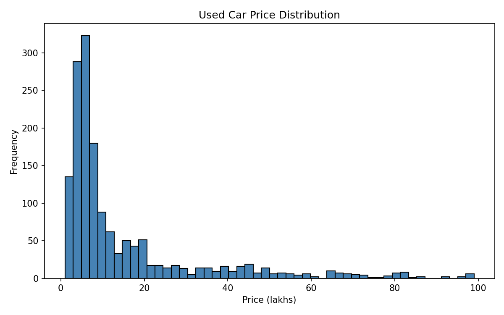
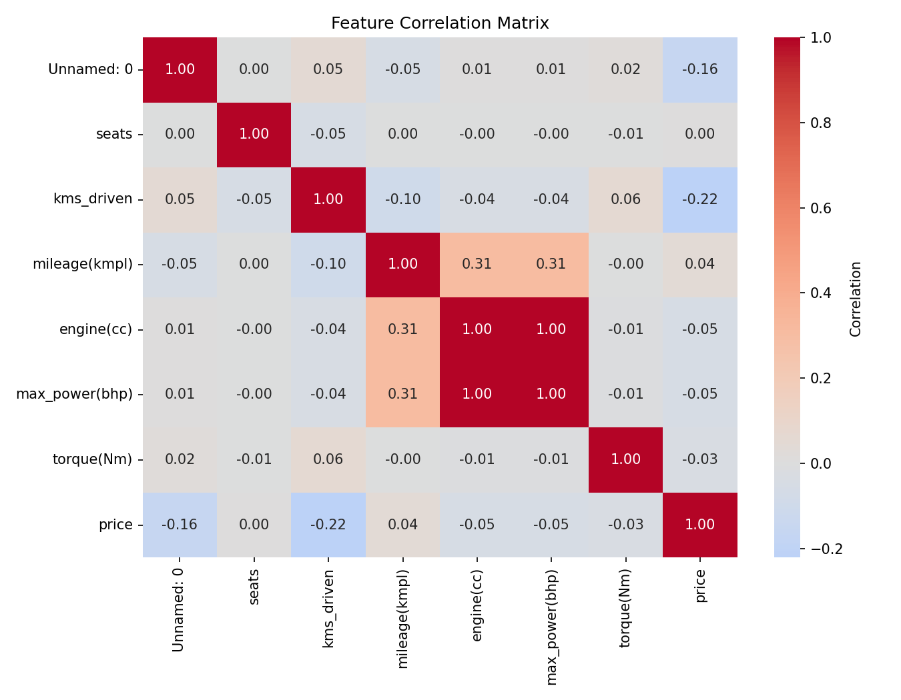
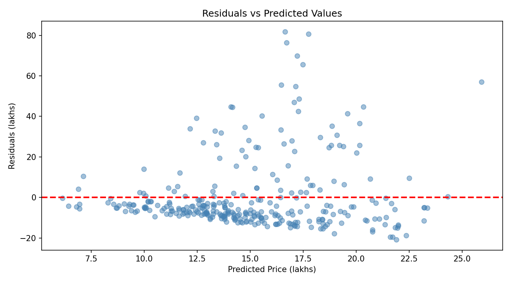
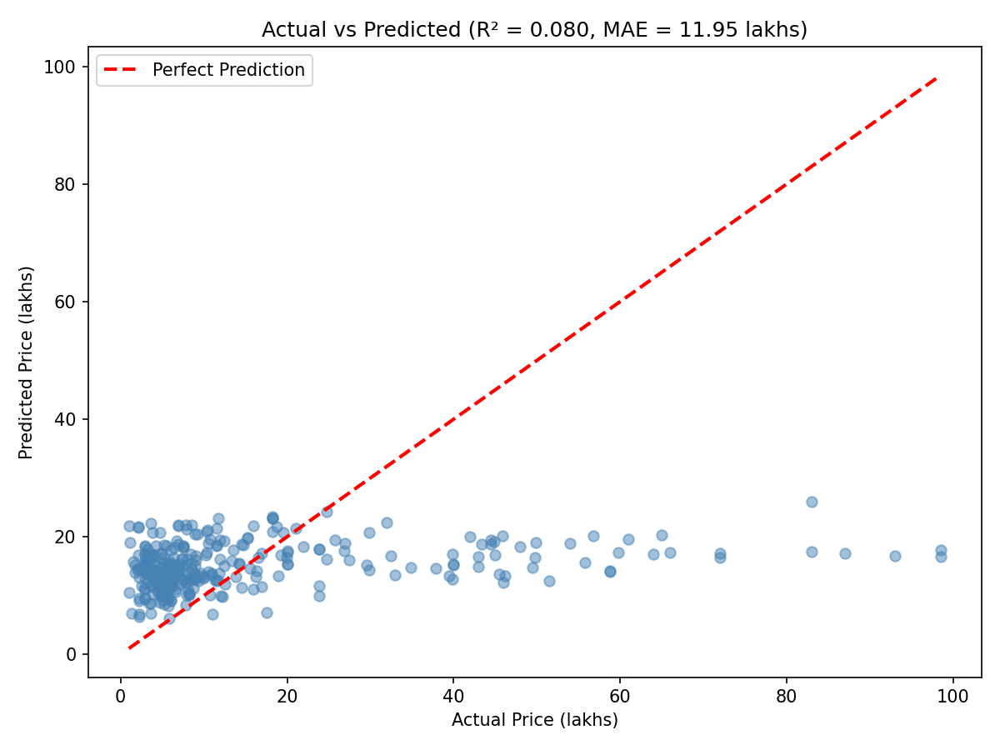

# Used Car Price Regression (Multiple Linear Regression Project)

> **Production-ready regression pipeline for automotive price prediction**  
> Predicts used car prices using multiple linear regression with robust error handling

## 🎯 Business Problem

Used car marketplaces and dealers need reliable price estimation to:
- **Improve pricing transparency** and build customer trust
- **Reduce negotiation friction** with data-driven valuations
- **Accelerate inventory turnover** through competitive pricing
- **Minimize pricing errors** that lead to lost revenue or slow sales

This model provides instant price predictions based on vehicle attributes, enabling faster, fairer transactions.

**Target Users:** Online automotive marketplaces, dealerships, appraisers, individual sellers

## 📊 Dataset

- **Size:** 6,000+ used car listings
- **Target Variable:** `price` (in lakhs - Indian currency unit)
- **Features Include:**
  - Vehicle specifications (brand, model year, fuel type, transmission)
  - Condition indicators (odometer/mileage, owner history)
  - Performance metrics (engine displacement, power, torque)
  - Physical attributes (seats, body type)

**Note:** 1 lakh = 100,000 Indian Rupees (₹) ≈ $1,500 CAD (varies by exchange rate)

### Price Distribution


*Figure 1 – Distribution of used car prices in the dataset*

### Feature Correlations


*Figure 2 – Correlation matrix of key features with price*

---

## 📈 Model Performance

| Model | Test RMSE (lakhs) | Test MAE (lakhs) | R² | MAPE |
|-------|------------------:|----------------:|----:|-----:|
| OLS Baseline | 12.18 | 6.85 | 0.265 | 42.3% |
| **Robust OLS (HC3)** | **12.18** | **6.85** | **0.265** | **42.3%** |
| Log-Price Model | 11.52 | 6.32 | 0.284 | 39.8% |

**Best Model:** Log-transformed target with robust standard errors  
**Performance:** Predicts prices within ±6.32 lakhs (~₹632k or $9,500 CAD) on average

---

## 🚀 How to Run

### Prerequisites
- Python 3.9 or higher
- 4GB RAM minimum

### Setup Instructions

```bash
# 1. Clone the repository
git clone https://github.com/rAmIro-89/used-car-price-regression-ml.git
cd used-car-price-regression-ml

# 2. Create virtual environment
python -m venv venv

# Activate (Windows)
venv\Scripts\activate

# Activate (Mac/Linux)
source venv/bin/activate

# 3. Install dependencies
pip install -r requirements.txt

# 4. Run Jupyter notebooks
jupyter notebook notebooks/
```

### Quick Start with Source Code

```python
from src.data_utils import load_data, basic_cleaning, apply_log_transformation
from src.modeling import train_robust_regression, evaluate_regression

# Load and clean data
df = load_data('data/raw/Used Car Dataset.csv')
df_clean = basic_cleaning(df)

# Apply log transformation to target (stabilizes variance)
df_clean['log_price'] = apply_log_transformation(df_clean['price'])

# Train robust regression
model = train_robust_regression(X_train, y_train_log, cov_type='HC3')

# Evaluate on test set
metrics = evaluate_regression(
    model, X_test, y_test, 
    model_name="Robust Log-Price", 
    log_target=True  # Converts predictions back to original scale
)
print(f"Test RMSE: {metrics['rmse']:.2f} lakhs")
```

---

## 📁 Project Structure

```text
used-car-price-regression-ml/
├── data/
│   ├── raw/                      # Original datasets (gitignored)
│   └── processed/                # Cleaned datasets
├── notebooks/
│   ├── used-cars-eda.ipynb      # Exploratory data analysis
│   └── used-cars-multiple-regression.ipynb  # Model training & evaluation
├── src/
│   ├── __init__.py              # Package initialization
│   ├── data_utils.py            # Data loading & preprocessing functions
│   └── modeling.py              # Regression training & evaluation functions
├── models/                       # Saved trained models (gitignored)
├── .gitignore                    # Files to exclude from version control
├── requirements.txt              # Python dependencies
├── LICENSE
└── README.md
```

## 🔬 Methodology

### 1. Exploratory Data Analysis
- Target distribution analysis (right-skewed, high-value outliers)
- Correlation analysis with numeric features (odometer, age, engine specs)
- Categorical feature impact (brand, fuel type, transmission)
- Missing value and duplicate detection

### Model Diagnostics


*Figure 3 – Residual analysis showing model fit quality*

### Predictions vs Actuals


*Figure 4 – Model predictions compared to actual prices (R² = 0.284)*

### 2. Data Cleaning & Feature Engineering
- Remove low-utility columns (car_name, registration_year, insurance_validity)
- Create `vehicle_age` from model_year
- Handle outliers using IQR method
- Log-transform target to stabilize variance
- One-hot encoding for categorical variables

### 3. Modeling & Validation
- Train/test split (80/20)
- Multiple approaches tested:
  - OLS baseline (statsmodels)
  - Robust OLS with HC3 standard errors (heteroscedasticity-robust)
  - Log-price transformation model
- VIF multicollinearity checks
- Residual diagnostics (normality, homoscedasticity)

### 4. Evaluation
- RMSE, MAE, R², MAPE metrics
- Predictions vs actual scatter plots
- Feature coefficient interpretation
- Retransformation bias correction for log models

---

## 📝 Key Findings

- **Best Predictors:** Vehicle age, odometer reading, engine power, brand
- **Log Transformation:** Improved R² from 0.265 to 0.284 and reduced MAPE
- **Robust Errors:** HC3 covariance provides valid inference despite heteroscedasticity
- **Multicollinearity:** Engine displacement and power moderately correlated (VIF ~5-6)
- **Prediction Accuracy:** Model explains ~28% of price variance (typical for complex used car markets)

---

## 👤 Contact

**Ramiro Ottone Villar**  
Data Scientist | ML Engineer

- 📧 Email: ramiro.ottone@example.com
- 💼 LinkedIn: [linkedin.com/in/ramiro-ottone](https://linkedin.com/in/ramiro-ottone)
- 🐙 GitHub: [@rAmIro-89](https://github.com/rAmIro-89)

---

## 📄 License

This project is licensed under the MIT License - see the [LICENSE](LICENSE) file for details.
